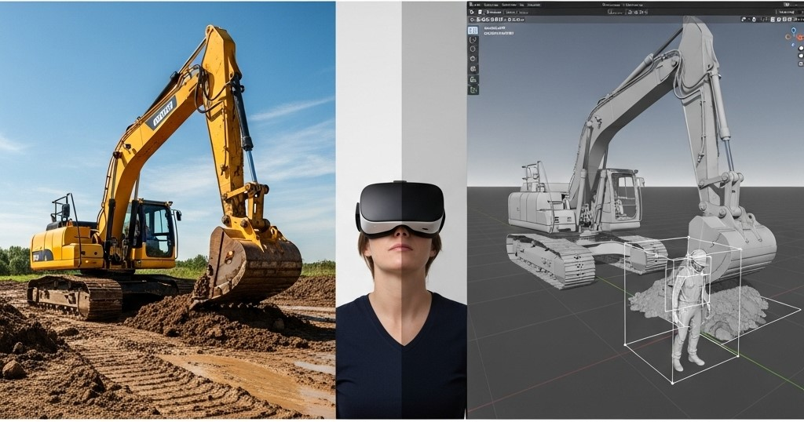
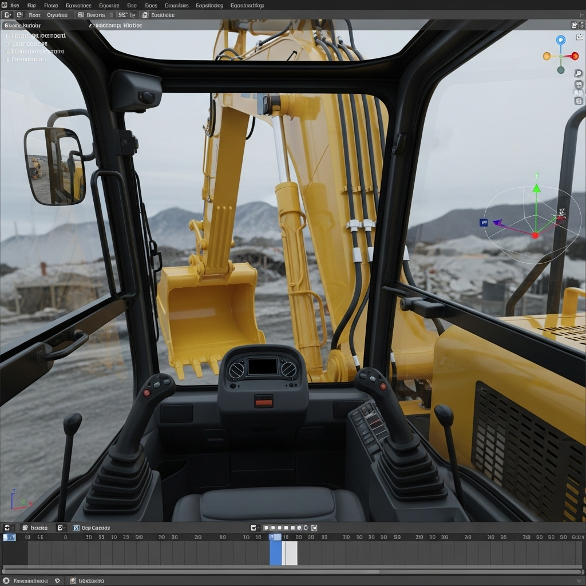
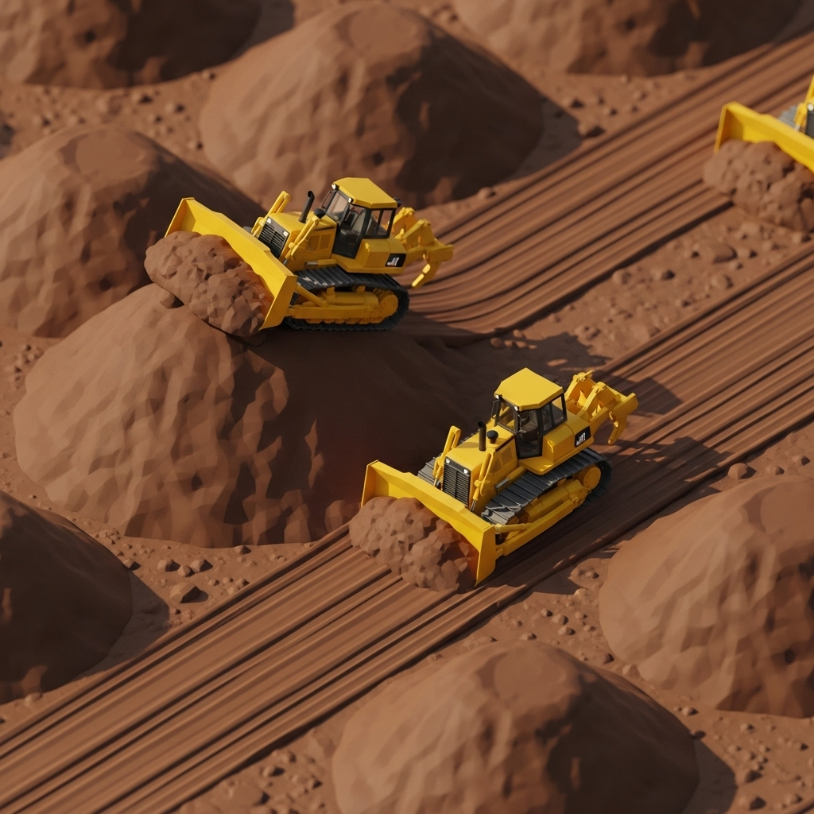

# Digital Twin with Virtual Reality

Bosch, Holzkirchen has presented itself as a competence center for Off-Highway expertise. My new topic was to strengthen this image further. As off-highway machines were quite difficult to transport, I saw a application of digital twin as a possibility to gain a better hands-on for the team, and at the same time reducing costs. I facilitated and coordinated launch of few deliverables&#x20;

* Driving heavy machineries in VR aka HeavyDuty
* Mounting and analyzing sensor FoV in VR aka VSVT
* Workflow Automation in VR

In the HeavyDuty program, it was possible to get inside the vehicle, drive it, perform certain tasks - all in a virtual environment

<figure><figcaption></figcaption></figure>

<figure><figcaption></figcaption></figure>

The VSVT (Virtual Sensor Visualization Tool) assisted application engineers to find an optimum mounting position of the sensors in a virtual environment. This enabled an early detection of wrong mounting positions, and hence save a lot of costs. The mounting position could have for example put wrongly, because it did not consider the moving parts in the vehicle.

<figure><figcaption></figcaption></figure>

Lastly the workflow automation we remodelled the Unreal Engine assets, so that they are closer to their real counterparts in terms of movement, traction, lifting loads etc.

<figure><figcaption></figcaption></figure>

The team used HTC Vive and Unreal Engine 5 to develop our software. We also were able to organize assets using DVC and GIT, so that we dont duplicate the creation of assets.

Unreal Engine, HTC Vive, Python, Autodesk, BIM, CAD
