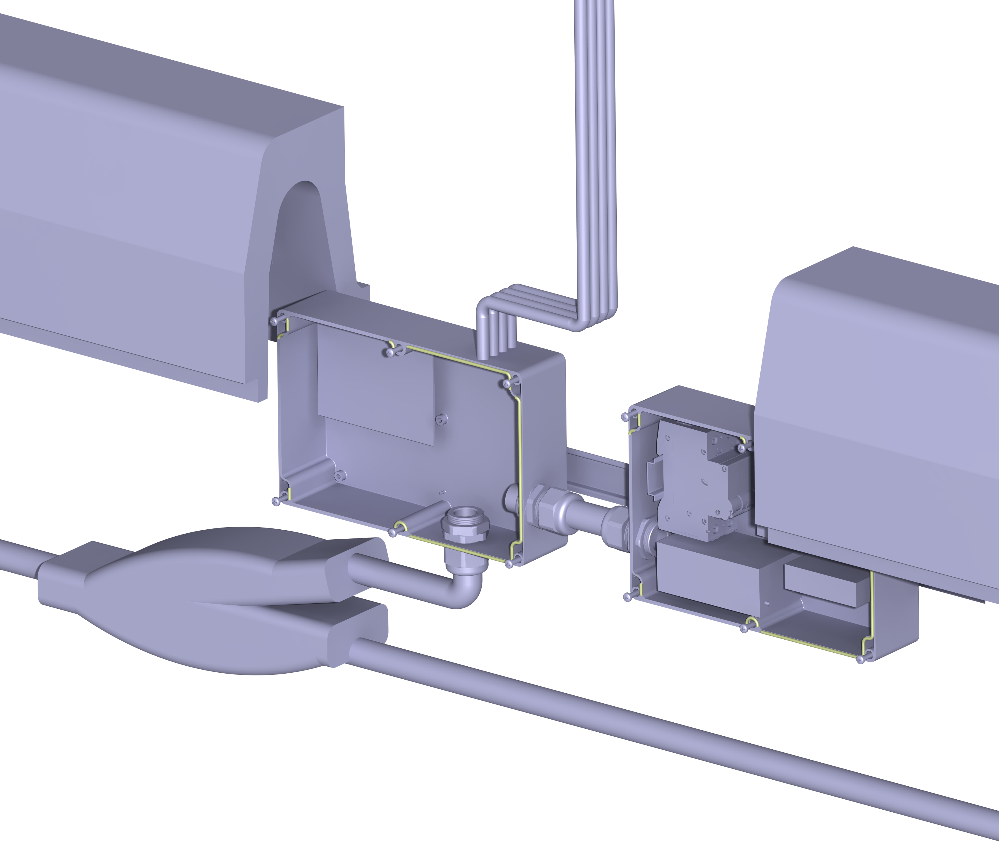
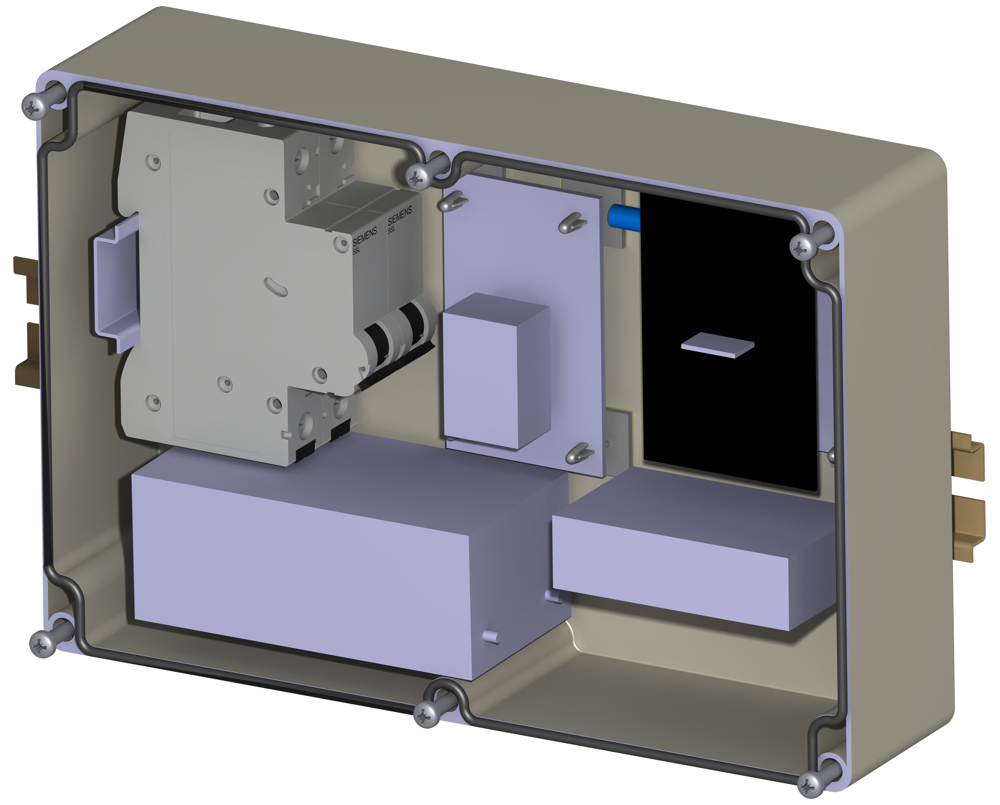

# iCurb - intelligent Curb

Award nominated construction of a smart parking detection and activation system for electric cars. Disclaimer: The work is based upon patent DE102010046263A1 and the development has been assisted by following people. The curbs has been provided by MEA Water Management GmbH.

The purpose of the project is to describe two tasks:

* eFind ( Find and Charge ) : how a user can reserve a parking spot and get authenticated automatically when he reaches the parking spot.
* iCurb: the methods to install an iCurb at events and in parking garages.

```
1. Driving the LEDs using Chromoflex , [Oemer Kayar; Vikas Agrawal]
2. Choosing the right sensor network protocol, [Niharika Ramachandramurthy; Vikas Agrawal]
3. Mecahnical design of the iCurb: [Daniel Borrmann, Lieselotte Ade, Vikas Agrawal]
4. Magnetic Sensor tests with Waspmote: [ Leander John, Vikas Agrawal]
5. Driving a charging unit over the bluetooth: [Julio Rodriguez, Andreas Sauter, Vikas Agrawal]

```

Sensor Box consisting of

* Parking detection and LED controller module
* Relay module to start / stop charging unit and authentication module using bluetooth
* Zigbee module to communicate with a gateway
* Smart Phone App to request starting and stopping the charging unit.

Parking detection and LED controller module

<figure><figcaption></figcaption></figure>

Relay module to start / stop charging unit and authentication module using bluetooth

<figure><figcaption></figcaption></figure>

Zigbee module to communicate with a gateway

<figure><figcaption></figcaption></figure>

Smart Phone App to request starting and stopping the charging unit.

<figure><figcaption></figcaption></figure>

The prototype involves a

* A Smart Phone app
  * to interact with the bluetooth module integrated in the infrastructure.
  * to query the parking garages and get the available parking spots for the electric vehicles
* A On Board Unit integrated in the car
  * with a bluetooth module to interact with the bluetooth module integrated in the infrastructure
  * that can query the parking garages to get the available parking spots for the electric vehicles.
* A LED Module embedded in the charging unit
  * To display the current situation of the parking spot.
  * RED indicates the parking spot is already reserved.
  * GREEN indicates the parking spot is not reserved and can be occupied.
  * BLUE indicates an ongoing authentication is taking place as the car reaches the parking spot.
  * BREATHING RED indicates that the CAR is being charged.
* Bluetooth Module embedded in the charging unit
  * To authenticate an incoming user with his Bluetooth MAC Address.
  * To be able to get the status of the charging unit over the bluetooth communication.
* Magnetic sensor embedded in the charging unit ◦
  * To be able to detect the presence of the car in the vicinity.
* Relay to start the charging process after a successful authentication.
* Zigbee communication module
  * The zigbee communication module interacts with the parking garage server and sends data of the occupancy of the parking spots.
  * Kommunikation zwischen verschiedenen iCurbs

Wie man hier sieht, einzelen icurb kommunizieren mit einanderen und übermitteln Ihre aktuelle Status ( Energie, Parkplatzbelegung etc. )

<figure><figcaption></figcaption></figure>

***

Prototype for the charging unit.

<figure><figcaption></figcaption></figure>

<figure><figcaption></figcaption></figure>

The prototype of the charging unit involves • Upper part of the curb ◦ contains the slot for the LED ◦ contains the method to lock the upper part with the lower part of the curb. ◦ contains the possibility to mount the box containing the electrical parts. • Lower part of the curb ◦ Contains the high voltage wires to charge the cars. ◦ Contains a hole to connect the socket with the incoming wires.

3 Areas of application:

```
    3.1 Events, Parking garages, On Street
```

The iCurb has a potential to provide robust channels to provide the required infrastructure of charging units. The projects can be applied 1. during the organization of big events with adhoc requirement of charging units. 2. Integrate the curbs already during the construction of new parking garages.

Einfache Installation bei Veranstaltungen: Skizze für die Installation des iCurbs bei Veranstaltungen. Man sieht ganz rechts eine Gateway

<figure><figcaption><p>Electric charging station</p></figcaption></figure>

<figure><figcaption><p>Blue labels denote embedded electronic units </p></figcaption></figure>

<figure><figcaption><p>Red dotted line denotes communication with the charging unit</p></figcaption></figure>

IKT for finding and reserving a parking place from a smart phone or an OBU: Ein Button in Autoradio iCurbs zu finden ( mögliche Industrieprojekt )

<figure><figcaption></figcaption></figure>

Das Smart Auto lädt über iCurb

<figure><figcaption></figcaption></figure>

LED Laufschrift um zu erkennen wie viele Parkplätze noch frei sind:

<figure><figcaption></figcaption></figure>

Other Patents Smart parking meter system

Abstract: Source: US2003179107A A Smart Parking Meter System makes it possible to track whether or not a vehicle occupies parking meter stalls and whether or not the time has expired. The system uses a wireless communication protocol which may be of the type known under the trade mark "Bluetooth" and provides the portability of embedded systems and the convenience of personal digital assistants with the powers of the C and Java programming languages. There are two main components to the Smart Parking Meter System, the handheld device, or the PDA, and the actual parking meters. Each device has the Smart Parking Meter System application installed in it, as well as the wireless modules, such as Bluetooth to use as a communication medium. The parking meters also have a motion sensor to detect any movement within it view range. The handheld device is able to extract all the parking states for each parking meter within a block or street depending on user configuration of system.

***

Title: Smart parking advisor

Abstract: Source: US6426708B A parking advisor images scenes of a parking area and identifies free spaces using image processing techniques. The advisor then makes recommendations as to which areas a driver should go based on the locations of free spaces. One way of outputting the recommendations is to display them on a terminal at an entry gate or to print them on a ticket, receipt, or other piece of paper. An entry terminal may be provided to allow the user to enter a preferred destination served by the parking area. For example, the destination could be a particular airline terminal or department store. The advisor may select, among the free spaces identified, those that are most convenient to the destination and provide corresponding directions. Title: Smart parking meter system Abstract: Source: US2003179107A A Smart Parking Meter System makes it possible to track whether or not a vehicle occupies parking meter stalls and whether or not the time has expired. The system uses a wireless communication protocol which may be of the type known under the trade mark "Bluetooth" and provides the portability of embedded systems and the convenience of personal digital assistants with the powers of the C and Java programming languages. There are two main components to the Smart Parking Meter System, the handheld device, or the PDA, and the actual parking meters. Each device has the Smart Parking Meter System application installed in it, as well as the wireless modules, such as Bluetooth to use as a communication medium. The parking meters also have a motion sensor to detect any movement within it view range. The handheld device is able to extract all the parking states for each parking meter within a block or street depending on user configuration of system.

```
Title:
```

SMART PARKING METER Abstract: Source: US2006152349A The present invention relates to a ‘smart parking system’ comprising of 1) ‘smart parking meter’ containing a radiofrequency reader (RF reader); 2) radiofrequency tag (RF tag) containing vehicle identification information, that is mounted on vehicles; 3) a central control station communicating with a multitude of ‘smart parking meters’ to form a network; 4) the said central control station having a central computer system programmed with parking enforcement instructions. RF reader is provided with means to interrogate the RF tag of a vehicle parked in the corresponding parking stall; and transmit information obtained thereby to a central control station. The central control station has means to identify the said vehicle and determine whether or not the said vehicle is legally parked. If a parking violation is detected, the central computer system remotely instructs the corresponding ‘smart parking meter’ to issue a parking ticket. Means are also provided in the ‘smart parking system’ to determine if a vehicle parked in a parking stall has previous unpaid parking tickets. The ‘smart parking system’ also has means to determine if a vehicle wanted by law enforcement personnel is present in a parking stall within its network. According to yet another aspect, the ‘smart parking system’ has means to determine if a parking stall in its network is vacant and to reserve the said vacant stall for an authorized driver. Further, means are provided in the ‘smart parking meter’ to accept multiple forms of payment.

Title: Smart parking occupancy management system

Abstract: Source: CN1979584A The invention relates to an intelligent parking space management system, mainly comprising: data collecting system, data communication system, central control system and alarming system, where the data collecting system mainly comprises charging-discharging circuit, signal amplifier circuit, A/D converting circuit, magnetic field sensor, first SCM and remote control signal receiver; the data communication system mainly comprises second SCM and receives the information transmitted by the first SCM transmits and transmits the received information through serial interface to the central control system; the central control system is composed of central control computer stored with the parking space information; the alarming system is connected with the first SCM and sends out alarm signals under the control of the first SCM. And the invention does not occupy ground space and can make the parking space safe and ordered.

Title: SMART PARKING CARD SYSTEM

Abstract: Source: KR100817335B A smart parking card system is provided to enable a driver to find out a parking booth by outputting position information of the parking booth using voice signals. A smart parking card(20) includes a wireless transceiver, an embedded speaker, and a parking position acknowledgement button. A parking card issuing unit is arranged at an entrance of a parking lot and issues the parking card. A parking guidance sensor(30) is arranged on a moving path of a vehicle and wirelessly transmits parking guidance information and parking position information to the vehicle, when the vehicle is close to the parking guidance sensor. A parking position sensor(40) is implemented at a bottom of the parking lot and transmits the parking position information, when a user pushes the parking position acknowledgement button. A central controller(60) stores a parking management program and is connected to the parking guidance sensor and the parking position acknowledgement sensor.

Title: PARKING GUIDE SYSTEM

Abstract: Source: KR100817342B A parking guidance system is provided to offer parking guidance information to users by displaying 2D or 3D images on a large-size display unit. A smart parking card(20) includes a wireless transceiver, a memory, and an embedded speaker. A parking card issuing unit(10) is arranged at an entrance of a parking lot and recognizes an incoming vehicle using a camera to issue the parking card. A parking guidance sensor(30) is arranged on a moving path of a vehicle and wirelessly transmits moving path information and parking position information to the vehicle, when the vehicle is close to the parking guidance sensor. An image display unit(40) is arranged at one side of the parking guidance sensor and outputs the parking guidance information and the parking position information on a transparent display unit, when information is exchanged between the parking guidance sensor and the smart parking card. A central controller stores parking management program and is connected to the parking guidance sensor.

Title: BRAKE SYSTEM AND METHOD

Abstract: Source: US2009195058A An electromechanical parking brake system for a heavy vehicle braked by air-actuated service brakes includes an EPB-ECU and a first electromechanical parking brake actuator controlled by the EPB-ECU. The electromechanical parking brake system further includes a redundant sub-system for applying a second parking brake in an event of a failure in the EPB-ECU or the first electromechanical parking brake actuator.

Title: SYSTEM AND METHOD OF VEHICLE MANAGEMNET FOR CAR SHARING, AND RECORDING MEDIUM THEREOF

Abstract: Source: KR101145371B PURPOSE: A cars management system for sharing car, method thereof, and recording medium thereof are provided to rapidly dispatch electronic cars that is completely charged and to manage and charge many cars in smart parking tower equipped with charging facilities. CONSTITUTION: A route selector installed at gate way of a parking lot selects charging route for electronic cars according to charging speed of electronic cars(S310). When the electronic cars are accepted in a storage charging unit installed inside the parking lot, the accepted electronic cars are charged(S320). The enclosing charge unit is moved along with the selected charge route using transport apparatus(S330).

Title: METHOD FOR OPERATING A MANUFACTURING SYSTEM FOR JOINING, AND MANUFACTURING SYSTEM FOR JOINING PREASSEMBLED STRUCTURES

Abstract: The invention relates to a method for operating a manufacturing system (1) and to a manufacturing system (1) for joining, transporting and handling preassembled structures (7), in particular motor vehicle body subassemblies, which are formed by components (6a, 6b) which are mounted loosely beforehand, comprising: a first component carrier (2) for receiving a first type of preassembled structures (7), a loading unit (3) which comprises a first manipulator (3b), wherein the first preassembled structure (7) is placed by the first manipulator (3b) onto the component carrier (2) in the loading unit (3), a joining unit (4) which comprises at least one joining robot (4b) with which the first preassembled structure (7) is joined together, and a transport unit (5) by means of which the component carrier (2) is movable between the loading unit (3) and the joining unit (4), wherein the transport unit (5) transports the component carrier (2), which is equipped with the first preassembled structure (7), into the joining unit (4), and wherein geoconnections of the first preassembled structure (7) are produced in the joining unit (4) by the joining robot or the joining robots (4c - 4f).

```
Title:
```

STEERING CONTROL METHOD OF A VEHICLE FOR ACTIVATING THE SPAS MODE AND THE MDPS MODE THROUGH THE MDPS CONTROLLER Abstract: Source: KR20110114897A PURPOSE: The steering actuator can be run through the MDPS controller which is the same controller in the SPAS(Smart Parking Assistance System) mode and the MDPS(Motor Driven Power Steering) mode. The separate controller for running the steering actuator to each for each mode can be omitted. CONSTITUTION: A steering control method of a vehicle comprises the following steps. It confirms whether the parking switch was turned on or not(S1). The parking switch was turned on and it confirms through the torque sensor whether the steering wheel is operated with the control of operator or not(S2). If the steering wheel does not act with the control of operator, it decides whether the parking space, and the park condition according to the can communications and velocity of car satisfy or not(S3). The park condition satisfies. If it is the case, the steering angle command is produced and the SPAS controller transmits with the MDPS controller through the can communication(S4). The motor current for presently controlling the steering actuator with the steering angle command according to the steering angle is produced(S6).

Title: The Intelligent Parking ballot box (AK-P702) (Machine translation)

Abstract: Source: CN301813856S Machine translation: The (Claim 1). The application design patent the name of the ballot boxes for the intelligent parking (AK-P702). (2) apply smart parking ballot box (AK-P702) is mainly used in the field of hotels, office buildings, shopping malls, theater facilities, airports, stadiums and exhibition centers, commercial pay parking, the residential area, as well as road crossing the parking lot. 3 of this application in the main view can show that the design points. 4 main design features of this application is the main view, rear view, as well as left and right view of the appearance of the shape.

Title: The Intelligent Parking ballot box (AK-the P701) (Machine translation)

Abstract: Source: CN301813857S Machine translation: The (Claim 1). The application design patent the name of the ballot boxes for the intelligent parking (AK-the P701). (2) apply smart parking ballot box (AK-the P701) is mainly used in areas of the parking lot of hotels, office buildings, shopping malls, theater facilities, airports, stadium and exhibition center commercial pay parking or district, and each road crossing. 3 of this application in the main view can show that the design points. 4 main design features of this application is the main view, rear view, as well as left and right view of the appearance of the shape.

Title: Smart parking card

Abstract: Source: TWM422137Y Machine translation: The invention relates to reveal a smart parking cards, to indicate that parking in the parking lot, comprising: a ticket information and parking information area. Flora of where the ticket information for the posted flow numbers of the good smart parking cards as well as vehicles entering the parking lot of the time, and other related information; information area of the parking spaces are marked with alphanumeric and / or graphics plurality of better parking space, and Department of such a better parking space marked with a parking ease, the convenience of motorists directly in accordance with the information of the parking spaces on the information in the good smart parking cards to quickly find the better parking space, and leave with the good marked on the smart parking cards, quickly find the vehicle parked in the parking lot, speed up the parking lot traffic and the avoid parking congestion circumstances.

Title: Intelligent Parking ballot box (AK-P703) (Machine translation)

Abstract: Source: CN301838835S Machine translation: The (Claim 1) 1 of the application for design patent the name of the ballot boxes for the intelligent parking (AK-P703). (2) apply smart parking ballot box (AK-P703) is mainly used in the field of hotels, office buildings, shopping malls, theater facilities, airports, stadiums and exhibition centers, commercial pay parking, the residential area, as well as road crossing the parking lot. 3 of this application in the main view can show that the design points. 4 main design features of this application is the main view, rear view, as well as left and right view of the appearance of the shape.

Title: NAVIGATION DEVICE WITH SMART PARKING AREA GUIDING FUNCTION

Abstract: Source: JP2012047650A PROBLEM TO BE SOLVED: To provide "a navigation device with a smart parking area guiding function" for guiding the peripheral facility of a smart PA, and for performing accurate guidance in the case of using the smart PA and its peripheral facility in expressway traveling. SOLUTION: When the simple display of an interchange (IC) or the like is performed in expressway traveling, and the IC where a preliminarily set smart PA is available is detected within the display range, not only the display of the smart PA but also the search and display of the peripheral facility of the smart PA is performed. When a user selects and instructs the display, the arithmetic operation and display and guidance of a guidance route on which the user goes to and back from the instructed smart PA or a guidance route on which the user goes to and back from the instructed peripheral facility via the smart PA is performed. In general road traveling, the smart PA and a target facility are highlighted. When several similar facilities are searched in the periphery, the facility estimated to be the optimal is highlighted.

Title: DEVICE AND METHOD OF CONTROLLING THE UNFOLDING OF AN OUTSIDE MIRROR FOR A VEHICLE CAPABLE OF PREVENTING A RISE IN MANUFACTURING COSTS BY OMITTING ADDITIONAL PARTS USING THE EXISTING SENSOR AND CONTROL UNIT OF A SMART PARKING SYSTEM

Abstract: Source: KR20120020746A PURPOSE: Device and method of controlling the unfolding of an outside mirror for a vehicle are provided to prevent damage to an outside mirror due to contact with obstacles since if the distance between the side of a vehicle and an obstacle is below a reference value, the unfolding of the outside mirror is prevented. CONSTITUTION: A device of controlling the unfolding of an outside mirror for a vehicle comprises a distance sensor(10), a control unit(12), a power window unit(14), and a smart-key control unit(16). The distance sensor is mounted on the side of the vehicle and senses the distance between the vehicle and an obstacle. The control unit receives the sensing signal of the distance sensor and determines the unfolding state of an outside mirror(20). The power window unit is connected to the control unit. The power window unit receives the unfolding command signal of the control unit.

Title: SMART PARKING ASSIST SYSTEM PERFORMING PARKING-OUT ASSIST OPERATION

Abstract: Source: KR20120032198A PURPOSE: An automatic parking assist system is provided to cancel an evection auxiliary operation if excessive torque is input. CONSTITUTION: An automatic parking assist system comprises a mode selecting part(100), a distance measuring part(110), a steering assist power feed port(140), a gear position sensor(150), and a controller. The mode selecting part outputs a mode selection signal or a mode release signal for processing or canceling the evection auxiliary operation. The distance measuring part measures a distance from objects locating near the vehicle. The distance measuring part outputs distance information signal. The steering assist power feed port supplies steering assist power. The gear position sensor outputs gear position signal corresponding to a location of the current gear. The controller is input mode selection signal. The controller grasps distance from the vehicle to objects in front and rear sides. The controller controls the steering assist power feed port.

Title: COMPUTER-IMPLEMENTED SYSTEM AND METHOD FOR MANAGING MOTOR VEHICLE PARKING RESERVATONS

Abstract: Source: US2012092190A A computer-implemented system and method for managing motor vehicle parking reservations is provided. Motor vehicle parking spaces are managed through a server. Smart parking devices physically proximate to the parking spaces are interfaced with the server. Vehicle occupancy sensors physically proximate to the parking spaces are interfaced with the server. Parking availability indicators associated with the parking spaces are interfaced with the server. A motorist reserves a parking space. A reservation request for the parking space is accepted. The request is granted if available over any other reservations. Occupancy of the requested parking space is sensed through the nearest vehicle occupancy sensor. The motorist's or the motor vehicle's identity are verified against the reservation through the nearest smart parking device. Parking availability is indicated through the nearest parking availability indicator based upon the current time, any motor vehicle occupancy, applicable parking regulations, or any unfulfilled reservations for the parking space.

Title: SMART PARKING ASSIST SYSTEM WHICH IS ABLE TO ADJUST VEHICLE HEIGHT OF VEHICLE

Abstract: Source: KR20120050272A PURPOSE: An automatic steering parking operation aid system capable of adjusting the height of a vehicle is provided to prevent the damage on the vehicle using an air suspension function for opening and closing doors of the vehicle. CONSTITUTION: An automatic steering parking operation aid system capable of adjusting the height of a vehicle includes the following: a side sensor(10) detecting the existence of a curb, and the height of the curb; a height sensor(31) sensing the height of the vehicle; and a controller(40) adjusting the height of the vehicle. The container controls an air suspension(60) based on the pressure value(32) of an air spring, the pre-saved ride height(20) of doors, and signals detected from the side sensor and the height sensor. The automatic steering parking operation aid system additionally includes a display unit(50) for displaying the current condition of the vehicle.

Title: SMART PARKING ASSISTANT CONTROL APPARATUS OF VEHICLE

Abstract: Source: KR20120060275A PURPOSE: An apparatus for controlling the intelligence parking assistance of a vehicle is provided to prevent the damage of the apparatus by alleviating the response of a motor driven power steering apparatus. CONSTITUTION: An apparatus for controlling the intelligence parking assistance of a vehicle includes a desired steering angle inputting part(12), a first subtracter(14), a position controlling part(16), a desired amount re-processing part(18), a desired speed limit setting part(20), a second subtracter(22), a speed controlling part(24), and an MDPS torque controlling part(26). The desired steering angle inputting part receives desired steering angel signal from an SPAS. The first subtracter obtains difference between a wheel steering angle and a desired steering angle. The position controlling part controls a wheel steering position. The desired amount re-processing part reduces the desired speed of a vehicle. The desired speed limit setting part sets a desired speed limit value. The second subtracter obtains difference between motor angular speed and desired angular speed. The MDPS torque controlling part converts the angular speed to torque.

Title: SMART PARKING PLACE SYSTEM

Abstract: Source: KR20120094180A PURPOSE: An intelligent parking lot system is provided to improve air quality by transmitting data, obtained through a low-power wireless sensor, to a monitoring server and determining the air quality based on the data. CONSTITUTION: Measured data is periodically transmitted to a wireless gateway. If a specific abnormal value is detected, the value is immediately transmitted to the wireless gateway. The wireless gateway the data received from a wireless sensor unit with a TCP/IP(Transmission Control Protocol/Internet Protocol) protocol. The wireless gateway transmits the mapped data to a monitoring server. The monitoring server transmits the received data to a DB(DataBase) server hosted by the outside.

Title: APPARATUS PERCEIVING A NEIGHBOR OBJECT FOR VEHICLES

Abstract: Source: KR20120105862A PURPOSE: A surroundings recognition system is provided to improve recognizing performance of parking area and obstacles by combining laser sensor and ultrasonic sensor. CONSTITUTION: A surroundings recognition system comprises a front sensor unit(10), a rear sensor unit, a first control unit and a second control unit. The front sensor part senses the front obstacles. The rear sensor unit senses the rear obstacles. The first control unit searches parking area according to the forward sensing signal and the rearward sensing signal. The second control unit searches the front obstacles according to the forward sensing signal. The front sensor unit comprises a front short-range sensor(11) and a front ultra short-range sensor(12). The front short distance sensor senses the obstacles in the front center, left front and right front. The front short distance sensor senses the obstacles within the front short distance. \[Reference numerals] (11) Front short-range sensor; (20) EBA control unit; (40) SPAS control unit; (AA) Front ultra short range sensor; (BB) Rear sensor unit

Title: PATH SEARCH DEVICE, PATH SEARCH METHOD AND PROGRAM

Abstract: Source: JP2012194179A PROBLEM TO BE SOLVED: To provide a path search device, a path search method and a program, which enable a re-search for a path to return to an expressway for reaching the destination if the turn-off point from a recommended path is "an exit designated to a smart parking area". SOLUTION: If determined that a vehicle itself has exited from an exit designated to a smart parking area service of a toll road away from the path designated by a path guide, a searched cost of a link connecting to an entrance designated to the smart parking area service corresponding to the aforementioned exit is set lower than the searched cost of link information to thereby re-search for a path to the destination from the present position.

Title: COOPERATIVE CONTROL APPARATUS OF MOTOR DRIVEN POWER STEERING APPARATUS FOR SMART PARKING ASSISTANT SYSTEM

Abstract: Source: US2012265404A The present invention relates to a cooperative control apparatus of a motor driven power steering apparatus for a smart parking assistant system (SPAS). The cooperative control apparatus may relieve excessive response of the motor driven power steering apparatus even through an excessive required steering angle is inputted from the SPAS, prevent damage of the motor driven power steering apparatus by controlling the motor driven power steering apparatus through a motor angular speed, reduce vibration, and improve steering performance with high control precision regardless of external disturbance.

Title: ELECTRONIC CONTROL UNIT OF SMART PARKING ASSIST SYSTEM AND PREPARATION METHOD FOR DRIVING IN THE ELECTRONIC CONTROL UNIT

Abstract: Source: KR20120117404A PURPOSE: An ECU(Electronic Control Unit) of an automatic parking assistance system and a driving preparing method for the ECU are provided to enable a driver to easily get out of a parking state of a car when the driver wants to drive the car again. CONSTITUTION: A regulator(310) is activated by a transceiver receiving a wake-up signal. The activated regulator supplies power to a micom(400) in a state that a car is turned off. The micom collects parking state information of the car. The micom calculates a steering angle for getting out of a parking state based on the collected information. The micom delivers the calculated steering angle to an ECU of an electronic steering device through the transceiver. \[Reference numerals] (100) Communication group; (110) Transceiver; (111) Wake-up monitoring unit; (112) Communication unit; (200) Power monitoring group; (210) Ignition voltage monitoring unit; (220) Battery voltage monitoring unit; (300) Regulator power group; (310) Regulator; (311) On/off switch; (312) Voltage converting unit; (400) MICOM; (AA) Battery voltage; (BB) Ignition voltage; (CC) CAN communication network

Title: PARKING ASSIST APPARATUS WITH PARKING MODE SELECTING FUNCTION AND METHOD THEREOF

Abstract: Source: KR20120126907A PURPOSE: A smart parking assist system having parking mode selection function and a method thereof are provided to assist parking by automatically selecting right angle parking or parallel parking through character recognition. CONSTITUTION: A smart parking assist system having parking mode selection function comprises a parking direction setting tool(10), imaging tools(20), an object recognizing tool(30), and a parking mode selecting tool(40), and a parking controlling tool(50). The parking direction setting tool is set the parking direction of the vehicle from an operator. The imaging tools are respectively installed at both sides of the vehicle and record the parked vehicles. The object recognizing tool recognizes the object from the recorded image. The parking mode selecting tool selects the right angle parking or parallel parking according to the recognized object. \[Reference numerals] (10) Parking direction setting tool; (20) Imaging tool; (30) Object recognizing tool; (40) Parking mode selecting tool; (50) Parking controlling tool

Title: The stacker (H-600) (Machine translation)

Abstract: Source: CN302188812S Machine translation: (Claim 1) 1. The name of the product of the design of the ballot box (H-600). 2. The purpose of the design products: built-in electronic equipment, machinery, wireless devices have the smart parking entrances management equipment required. 3. The design features of this design is that: the overall shape of the asymmetric design. 4. Best product design points of the design drawings for a perspective view.

Title: Smart parking plot control system

Abstract: Source: CN202658936U The utility model discloses a smart parking plot control system, comprising a parking plot lock unit, a receiving unit, a processing unit and a remote card, wherein the parking plot lock unit comprises a parking plot lock controller, a motor and a parking plot lock; the receiving unit comprises a remote card reader and a receiver; the processing unit comprises a remote card issuing read head, a processor and a server; the remote card corresponds to the remote card issuing read head; the output end of the remote card issuing read head is in wireless connection with the input end of the processor; the processor is connected with the server; the remote card reader is in wireless connection with the remote card; the output end of the remote card reader is in wireless connection with the input end of the receiver; the output end of the receiver is connected with the input end of the processor; the output end of the processor is connected with the parking plot lock controller; the output end of the parking plot lock controller is connected with the motor; and the output end of the motor is connected with the input end of the parking plot lock. The parking plot control system effectively prevents the parking plot from being occupied by other cars and is convenient for centralized management of parking plots of a park.

Title: METHOD AND SYSTEM FOR DYNAMIC PARKING ALLOCATION IN URBAN SETTINGS

Abstract: A "smart parking" system and method for an urban environment based on a dynamic resource allocation approach. The system assigns and reserves an optimal resource (parking space) for a discrete user based on the user's objective function that combines proximity to destination with parking cost, while also ensuring that the overall parking capacity is efficiently utilized. The solution of each Mixed Integer Linear Program (MILP) is an optimal allocation based on current state information and subject to random events such as new user requests or parking spaces becoming available.

```
Title:
```

INTELLIGENT PARKING SPACE LOCK CONTROLLER BASED ON CAN Abstract: Source: CN202711011U Machine translation: The utility model discloses a CAN-based smart parking lock controller includes a central processor module, CAN bus control module, motor driver module, wireless receiver module, geomagnetism detection module and power module; their structural characteristics for the CAN bus control module, motor driver module, wireless receiver module, geomagnetism detection module and power module is connected to the central processor module. The utility model by information from the CAN bus receive control motor movements, and easy to operate wireless receiving module artificial operation, parking lock function, by geomagnetic module detects parking state, but also by the utility model and motor connected to the signal line to detect the state of the parking lock, to facilitate the management of the car park.

Title: SURVEILLANCE VIDEO-BASED INTELLIGENT PARKING LOT MANAGEMENT SYSTEM

Abstract: Source: CN102915638A Machine translation: The invention belongs to the field of video surveillance technology, specifically for the smart parking management system based on the surveillance video. The present invention is mainly used in large indoor and outdoor parking, covered by several camera tracking vehicles within the field of view, and monitor parking spaces and to reflect individual parking spaces parking situation in real time. The present invention first by image Get module obtained camera captured the image, and then use computer vision algorithms to construct automatic detection module, and to achieve a vehicle tracking, parking space detection and license plate recognition, and through the information statistical output module will be the data mutually associated, the vehicle in the parking All data and output of the venue of the show. The present invention reduces the consumption of large car park management, human resources, while avoiding the drawbacks of existing detection techniques, the use of the surveillance video, automatic intelligent detection, thereby improving the quality of monitoring and reduce monitoring costs.

Title: Parking stacker (T10) (Machine translation)

Abstract: Source: CN302313617S Machine translation: (Claim 1) in this design Product Name: Parking ballot box (T10). Purposes: for smart parking. Design points is that the design of the overall shape of the product. Most can show pictures or photos of the main points of the design: the main view. 5 bottom view of the design points, omit the bottom view.

Title: PARKING PLOT GUIDING AND REVERSE VEHICLE TRACKING METHOD FOR PARKING LOT

Abstract: Source: CN102930744A Machine translation: The present invention provides a method for parking parking guidance and to reverse car search method, which when the vehicles entering the parking lot and parking into place, the system will store the relationship of parking spaces and vehicle, the driver returns the car park. informed by the vehicle inquiries machine vehicles parked parking spaces. The present invention vehicle guidance and reverse car search function integration, wireless parking spaces detection card, wireless vehicle identification card, parking guidance screen and vehicle inquiries machine, greatly improving the smart parking management and efficiency.

Title: INTELLIGENT PARKING SYSTEM WITH REVERSE VEHICLE LOOKUP FUNCTION

Abstract: Source: CN102938216A Machine translation: The present invention provides an equipped the reverse car search function Intelligent Parking System, including parking status indicator (1) parking space detection card (2), the vehicle identification card (3), wireless communication base station (4), the host computer (5), camera (6), vehicle inquiries machine (7) and the parking guidance screen (8). The present invention vehicle guidance and reverse car search function integration, wireless parking spaces detection card, wireless vehicle identification card, parking guidance screen and vehicle inquiries machine, greatly improving the smart parking management and efficiency.

Title: INTELLIGENT PARKING LOCK SYSTEM

Abstract: Source: CN202788114U Machine translation: The utility model discloses a smart parking lock system, designed to provide a parking lock system does not require the owners can get off control. Comprising a signal transmitter, signal receiver, a controller and a plurality of stopper means and said blocking mechanism including a motor connected with a controller electrically connected to said controller and said signal receiver. The signal transmitter sends a wireless signal to the signal receiver. The signal receiver will receive the control signal is passed to the controller, the controller parses the blocking mechanism, the control to open or close the control signal from the setting signal source. When the owner drove off, you do not need to get off the blocking mechanism to open by the signal transmitter can control, to prevent other vehicles occupied private parking; owners drove back through the signal transmitter can control parking lock is off in the car, the vehicle can stop into parking spaces. The utility model is applicable to all private parking spaces.

Title: INTELLIGENT PARKING LOT MANAGEMENT SYSTEM

Abstract: Source: CN202795768U Machine translation: The utility model discloses a smart parking management system, including the parking condition detection module, vehicle safety management module, smart charging module and the control center module, the control center module charges and parking condition detection module, vehicle safety management module and smart The module is connected. Parking seeking fast car, and charges fast and high safety factor.

Title: VEHICLE IDENTITY IDENTIFICATION SYSTEM BASED ON RFID TECHNOLOGY

Abstract: Source: CN202815941U Machine translation: The utility model discloses a vehicle identification RFID technology system, including application servers, management client-server, and communication systems, characterized in that: a RFID-based vehicle identification system includes RFID smart parking lock, RFID smart card the RFID smart Daozha, the RFID smart parking locks installed in parking spaces on the ground, the said RFID smart Daozha installed at the inlet and outlet of the garage, and the said RFID smart Daozha connected through the communications system and the application server. The simple structure, ease of installation, the distance identification system using RFID technology, the parking lock the system is locked in parking spaces, combined with the long-distance RFID reader and smart Daozha parking import and export without stopping identity systems.

Title: The Intelligent Parking meters path (Machine translation)

Abstract: Source: CN302360106S Machine translation: (Claim 1) 1. The design products Name: Road car park smart parking meters. 2. The design uses: record stop time and calculate the parking fee. 3. The design features of the design: perspective view. 4. Best to show that the design drawings or photographs of the main points: the perspective view.

Title: Smart parking meters (Machine translation)

Abstract: Source: CN302371318S Machine translation: (Claim 1) design products name: smart parking meters; Uses: This product is a solar roadside equipment, mainly for vehicle-street parking electronic toll collection and parking management, intelligent transportation applications; 3 design point is that the the product overall shape; representatives Figure: perspective view.

Title: NON-WAITING PARKING MANAGEMENT SYSTEM BASED ON RFID (RADIO FREQUENCY IDENTIFICATION DEVICE) AND SENSOR

Abstract: Source: CN202838451U Machine translation: The vehicle identification utility model discloses a RFID and parking sensor-based smart parking management system, which includes the vehicle identification RFID, vehicle detection sensor, and a back-end server, vehicle detection sensor through wired or wireless communication network and the backend server connection; connected via RFID wireless communication protocols between RFID and vehicle detection sensor; vehicle detection sensor and the backend server through wired or wireless network connection. Used in the process of the present utility model, can make the driver stop, and to take the car, without manual operation, to achieve the accuracy of the parking fee, automatic pay payment.

Title: NAVIGATION DEVICE

Abstract: Source: JP2013061198A PROBLEM TO BE SOLVED: To provide a navigation device which can perform a charging-facility guidance effectively utilizing a SPA (Smart Parking Area) service when a driver driving an electric vehicle needs to charge the vehicle while traveling on a toll road supporting the SPA service. SOLUTION: A route setting unit 116 sets a route as a guidance route which has the total of a traveling time, a desired charging time, and an SPA utilization time within a predetermined time defined by a SPA service and also has the largest number of pass-by charging facilities among routes which quits a toll road from an SPA target interchange (IC) exit, passes via an SPA and a charging facility nearby the SPA, and takes a toll route from an SPA target IC entrance. Alternatively, the route setting unit 116 sets a route as the guidance route which provides the earliest expected arrival time at the SPA target IC entrance among routes in which it is possible to reserve for a charging for the desired charing time from the expected arrival time at a pass-by charging facility, and also the total of the traveling time, the desired charging time, and the SPA utilization time is within the predetermined time defined by the SPA service.

Title: SYSTEM AND METHOD FOR SMART PARKING ASSIST

Abstract: Source: KR20130036387A PURPOSE: An automatic parking assistant system and a method thereof are provided to accurately measure a distance between a target object and a vehicle by 'measuring the form of the target object located around the vehicle by using a division amplitude and the dispersion energy of a received ultrasonic signal' and 'applying a method measuring the distance according to the form of the target object'. CONSTITUTION: An automatic parking assistant system includes a sensor unit(110) 'transmitting an ultrasonic signal toward a target object located around a vehicle by being installed in the vehicle' and 'receiving the ultrasonic signal reflected in the target object'; and a control unit(120) estimating the form and width of the target object by using the ultrasonic signal received in the sensor unit. An automatic parking assistant method includes a step transmitting an ultrasonic signal toward a target object located around a vehicle and receiving the ultrasonic signal reflected in the target object; and a step estimating the form and width of the target object by using the received ultrasonic signal. \[Reference numerals] (110) Sensor unit; (120) Control unit; (130) Warning unit;

Title: METHOD OF CALCULATING DYNAMIC RADIUS OF TIRE

Abstract: Source: KR20130050681A PURPOSE: A method of calculating the dynamic radius of a tire is provided to improve a parking alignment by effectively calculating the dynamic radius of left and right tires for applying to the development of logic such as an SPAS(Smart Parking Assist System). CONSTITUTION: A method of calculating the dynamic radius of a tire comprises the following steps: comparing a yaw angle or lateral position value which is numerically calculated according to the dynamic radius of left and right tires with a sensed value form a yaw rate sensor or direction related sensor; reducing the radius of the left or right tire according to the compared result value; determining whether the absolute value of the compared result value is same or less than a reference value; and confirming the numerically calculated yaw angle or lateral position value as the dynamic radius of the left and right tires when the absolute value is same or less than the reference value. \[Reference numerals] (AA) Start; (BB) End; (S10) Turn on or initialize a SPAS(or other system); (S12) Detect a space and determine whether a vehicle is moving forward?; (S14) Calculate a numerical yaw angle or lateral position; (S16) Yaw angle(Lateral position) or direction related sensor; (S18) Numerical yaw angle(Lateral position)> Sensor data?; (S20) Slightly reduce a right radius; (S22) Slightly reduce a left radius; (S24) ¦Numerical yaw angle(Lateral position) - Sensor data¦ < 10(-3)?; (S26) Utilize for confirmation of a dynamic radius and for related systems Classifications: International (IPC 8-9): B60C23/04 B60R19/48 (Advanced/Invention)

Title: SMART PARKING SPACE ALLOCATION SYSTEM AND METHOD

Abstract: Source: US2013132102A The present disclosure relates generally to parking space allocation systems and methods, and particularly, to parking space allocation systems and methods for use in connection with parking at a mall.

Title: Barrier one machine

Abstract: Source: CN302470377S 1. The design is the product name: Barrier one machine. 2. The design uses of products: for parking management system, smart parking charge system, which sets credit card charge control devices and barrier in one. 3. The design features of the design: that the product combination of shapes and patterns. 4. Best show or photographs of the design elements: Design a perspective view. 5. Design a basic design as specified. 6. Design a gray area and design 2 translucent material used to provide night lighting and warning. 7. Design 1 bottom uncommon Design 1 bottom diagram is omitted. 8. Design the bottom is not common, omitting design two bottom view.

Title: Intelligent Parking ballot box (AK-P803)

Abstract: Source: CN302525504S 1. present application design patent name for the smart parking ballot box (AK-P803). (2) The application for smart parking ballot box (AK-P803) mainly used in hotels, office buildings, shopping malls, theaters facilities, airports, stadiums and exhibition center business district and various pay parking or road crossing the parking areas. (3) The application main view shows that the best design points. 4 main design features of this application lies in front view, rear view, and the view about the appearance of the shape of the formation.

Title: SMART PARKING ASSIST SYSTEM AND METHOD THEREOF

Abstract: Source: KR20130089502A PURPOSE: A smart parking assist system is provided to detect a curbstone on a parking space and recognizing the pattern of the curbstone, thereby enabling more accurate automatic parking. CONSTITUTION: A smart parking assist system comprises a sensor part (110) installed on a side of a vehicle to detect obstacles placed on the side of the vehicle and a curbstone in a parking space formed by the obstacles; curbstone recognition part (120) for estimating the change rate of distance between the side of the vehicle and the curbstone and for recognizing the pattern of the curbstone based on the estimated change rate; and an electronic control part (130) for calculating a parking space by using the pattern recognition result of the curbstone. \[Reference numerals] (122) Kerb sensing unit; (124) Function conversion unit; (126) Slope assuming unit; (128) Kerb pattern determining unit; (AA) From 110; (BB) To 130

Title: METHOD CONTROLLING ACTION CYCLE OF SPAS ULTRASONIC SENSOR

Abstract: Source: KR20130089458A PURPOSE: A method for controlling the operational cycle of an ultrasonic sensor of an SPAS (Smart Parking Assist System) is provided to improve the accuracy of space search by dynamically controlling the operational time of LIN (Local Interconnect Network) communication in the process of searching a parking space and to improve detecting performance without any specific external device. CONSTITUTION: A method for controlling the operational cycle of an ultrasonic sensor of an SPAS comprises the step of: dividing the detection range of the ultrasonic sensor into three areas of Zone1, Zone2 and Zone3 and setting the operational time of Zone1 as Ztime1, the operational time of Zone2 as Ztime2, and the operational time of Zone3 as Ztime3; a first control step at which the ultrasonic sensor is controlled to measure the detection range of Zone3 during Ztime3; a first decision step at which an operational time and a detection area are decided based on the measured detection range at the first control step; a second control step at which the ultrasonic sensor is controlled to measure a detection range of the detection area during the LIN communication time decided at the first decision step. Herein Zone1 and lt; Zone2 and lt; Zone3, and Ztime1 and lt; Ztime2 and lt; Ztime3.

Title: Solar vehicle inspection device

Abstract: Source: CN302534157S 1. Designs Product Name: Solar vehicle inspection device; 2. Uses: The product is a vehicle designed to detect the presence or absence or obtain vehicle speed, direction, location and other information processing equipment intelligent analysis, the use of solar energy and back-up battery, can be used in the ETC system, smart parking meters, car parks and parking management, road traffic data collection monitoring and other intelligent transportation applications; 3 product design point is the overall shape; 4. Representative Figure: Three-dimensional map.

Title: SMART PARKING ASSIST SYSTEM IN CURVES AND METHOD THEREOF

Abstract: Source: KR20130094995A PURPOSE: An auto-parking system for curved road and a method thereof are provided to enable auto-parking in road having various radius of curvatures. CONSTITUTION: An auto-parking system for curved road comprises: a distance detection part which senses a distance of a first obstacle and a distance of a second obstacle positioned at a lateral part of a vehicle; a control part which scans a lateral part of the vehicle through a distance measuring sensor during the forward state or reverse state of the vehicle and auto-parks the vehicle between the first obstacle and the second obstacle in order to be parallel to a virtual straight line which connects the final sensing point of the first obstacle and the initial sensing point of the second obstacle obtained by the distance measuring sensor. An auto-parking method for curved road comprises: a step of scanning a lateral part of a vehicle through a distance measuring sensor during the forward state or reverse state of the vehicle; a step of obtaining a final sensing point of a first obstacle and an initial sensing point of a second obstacle obtained by the distance measuring sensor; and a step of auto-parking the vehicle in order to be parallel to a virtual straight line which connects the final sensing point of the first obstacle and the initial sensing point of the second obstacle. \[Reference numerals] (AA) Start; (BB) End; (S100) Obtain distance data from the side of a vehicle; (S200) Obtain P1, P2, P3, P3, P4, P5, P6 location values; (S300) Calculate slope M of line 1 based on obtained location values; (S400) Generate a parking trace; (S500) Calibrate a parking trace Title: INTELLIGENT PARKING MANAGEMENT METHOD AND SYSTEM BASED ON CAMERA

Abstract: Source: KR20130097868A PURPOSE: A camera based intelligent parking control method and a system thereof prevent traffic congestion in a parking lot by automatically checking the condition of the parking lot and informing available positions for parking. CONSTITUTION: An object detection unit (31) detects a moving object from a wide area pan-tilt-zoom (PTZ) camera image, classifies whether the moving object is a person or a vehicle, and estimates the position of the object. An object tracking unit (32) controls the direction and angle of a local PTZ camera closest to the position of the estimated object among local PTZ cameras installed at first to nth parking sections to photograph the object closely. A vehicle recognition unit (33) detects the vehicle in a parking section and recognizes a number while rotating the local PTZ cameras installed at the first to mth parking sections. \[Reference numerals] (10-1,10-n) Wide area; (20-1,20-2,DD,20-m) Area; (30) Smart parking control device; (31) Object detection unit; (32) Object tracking unit; (33) Vehicle recognition unit; (34) Control unit; (34a) Vehicle type recognition unit; (35) Accident decision unit; (35a) Proximity decision unit; (40) Monitor device; (50) Display device; (AA) 10-1 or 10-n: 10; (BB) 20-1 or 20-m: 20; (CC) Monitoring area display example

Title: SMART PARKING ASSIST SYSTEM OF VEHICLE AND CONTROL METHOD THEREOF

Abstract: Source: US2013289825A Disclosed herein are a parking assist system to park a vehicle at the center of a target position in parking of the vehicle at the target position and a control method thereof. A control method of a parking assist system including a state sensor to sense a state of a vehicle, an obstacle sensor to sense obstacles present at a front side, a rear side or lateral sides of the vehicle, and an interface to provide a driver with information about a state or operation of the vehicle includes computing a parking path for the vehicle based on results of sensing by the state sensor and the obstacle sensor, controlling steering of the vehicle such that the vehicle is parked at a target position along the computed parking path, and when the vehicle reaches the target position, controlling steering of the vehicle to position the vehicle at a center of the target position based on information related to situations at the front and rear sides of the vehicle sensed by the obstacle sensor.

Title: SMART PARKING ASSIST SYSTEM OF VEHICLE AND CONTROL METHOD THEREOF

Abstract: Source: KR20130106005A PURPOSE: A steering assistance system for parking a vehicle and method for controlling the same is provided to prevent possible danger while parking a vehicle if a tire condition is inappropriate for using a smart parking assistance system. CONSTITUTION: A steering assistance system(100) for parking a vehicle comprises: a state detection part(110) which senses the state of the vehicle; an obstacle detector(120) which senses obstacles that exist in all directions; a routing unit(132) which sets a driving path for parking based on the results of the state detection part and the obstacle detector; a steering angle setting unit(133) which sets the steering angle of the vehicle based on the driving path set by the routing unit; a steering controller(140) which controls a steering wheel of the vehicle based on the steering angle set by the steering angle setting unit; a monitoring unit(160) for monitoring the tire condition; and a tire state processing unit(134) which determines whether or not the condition of the tire based on the result of the monitoring unit is appropriate for parking by an auto-steering capability. \[Reference numerals] (110) State detection part; (120) Obstacle detector; (130) Main control unit; (131) Parking space recognizing unit; (132) Routing unit; (133) Steering angle setting unit; (134) Tire state processing unit; (135) Motion switching unit; (140) Steering controller; (151) Output unit; (152) Input unit; (160) Tire state monitoring unit

Title: CLOUD PLATFORM BASED SMART PARKING MANAGEMENT AND SERVICE SYSTEM

Abstract: Source: CN103337007A The invention discloses a cloud platform based smart parking management and service system and belongs to the application of cloud computing technology in the field of parking management and service. The system adopts a distributed data processing framework and is characterized in that a gross data central server colony is arranged in a gross data central management department of the system, a regional data center server colony is arranged in the data center administration of each province or city, and the gross data central server colony is respectively connected with the regional data center server colonies through communication network. According to the invention, a distributed data base is built in each city to real timely acquire and save static data and dynamic data relative to all parking lots in the city. Due to the adoption of the technical scheme, remote on-line management function of the parking lots can be realized, so as to provide various functions for a driver, including ubiquitous dynamic parking navigation, parking stall reservation, time-staggered parking, online parking stall lease, on-line payment of parking fee, online car washing and the like.

Title: SMART PARKING ASSIST SYSTEM OF VEHICLE AND CONTROL METHOD THEREOF

Abstract: Source: KR20130113092A PURPOSE: A parking assist system for a vehicle is provided to induce a vehicle to a park possible area through HMI feedback, thereby improving the performance of the system. CONSTITUTION: A parking assist system (100) for a vehicle comprises: a state detection part (110) which detecting the state of a vehicle; an obstacle detector (120) which recognizes an obstacle adjacent to the vehicle and senses a distance between the obstacle and the vehicle; an interface unit (150) which provides an operator with the state of the vehicle or information related with operation; and a control unit (130) which recognizes the parking space of the vehicle based on information which is delivered from at least one among the state detection part and the obstacle detector and determines whether the vehicle is positioned within a park possible area or not. \[Reference numerals] (110) State detection part; (120) Obstacle detector; (130) Control unit; (140) Steering control unit; (151) Output unit; (152) Input unit

Title: SMART PARKING ASSISTANT SYSTEM FOR EASY GET ON OR OFF OF VEHICLE PASSENGER AND METHOD THEREOF

Abstract: Source: KR20130120183A An automatic parking assistant system for the comfortable boarding of vehicle passengers and a method thereof are disclosed. The automatic parking assistant system and the method help vehicles to be parked to be leaned to the left side or right side inside a parking space by considering the expected direction in which the passengers board. Accordingly, the passengers can easily board on the vehicle to the expected direction when the vehicle is parked in a narrow parking space. \[Reference numerals] (100) Switch;(200) Sensor unit;(300) User interface

Title: SMART PARKING ASSIST SYSTEM AND THE METHOD FOR WHEEL RADIUS CORRECTION THEREOF

Abstract: Source: KR20130124051A Disclosed are a smart parking assist system and a method for correcting wheel radius. The wheel radius correcting logic according to the present invention comprises: a determination unit checking whether or not a vehicle situation corresponds to a correction value calculation condition by using the speed of a vehicle on the driving, a yaw rate value, and steering angle information before performing a smart parking assist function and determining whether the vehicle drives straight or wheels if it is corresponded to the correction value calculation condition; a correction value calculation unit determining one or more first correction values correcting a radius of a left rear wheel and one or more second correction values correcting a radius of a right rear wheel by distinguishing whether it goes straight or wheels and using the wheel speed from a left rear wheel sensor and a right rear wheel sensor and the yaw rate value; and a storing unit storing the first and second correction values. \[Reference numerals] (210) Determination unit;(220) Correction value calculation unit;(230) Storage unit;(AA) Vehicle speed;(BB) Steering angle information;(CC) Yaw rate value;(DD) Rear wheel information

Title: SMART PARKING ASSIST SYSTEM WITH DETERMINING OF TARGET PARKING LOCATION ACCORDING TO CLASSIFYING OF OBSTACLE FORM AND METHOD THEREOF

Abstract: Source: KR20130124050A A smart parking assist system with a function determining target parking position according to shapes of obstacles and a method thereof are disclosed. The smart parking assist system and the method thereof are capable of conveniently opening a door by parking the vehicle to be sufficiently far from the obstacles if the obstacle is a barrier and preventing an unnecessary available space by parking the vehicle to be adjacent to the obstacles if the obstacle is the kerb as parking position is determined by distinguishing that the obstacle in a parking lot is the barrier or the kerb. \[Reference numerals] (100) Sensor unit;(110) First ultrasonic sensor;(120) Second ultrasonic sensor;(200) Steering device;(300) Control unit;(310) Curb/wall judgement unit;(320) Parking location determination unit;(330) Parking trajectory generation unit

Title: THE CONTROL METHOD OF BRAKE OIL PRESSURE IN THE EVENT OF EMERGENCY STOP THROUGH SPAS

Abstract: Source: KR20130123784A The present invention relates to a brake oil pressure control method in an emergency stop through a smart parking assist system which includes a step of charging brake oil in an accumulator when the smart parking assist system is operated; a step of sensing emergency situations; and a step of injecting the brake oil charged in the accumulator to a brake caliper when the emergency situation is occurred. According to the embodiment of the present invention, the braking pressure is rapidly formed by rapidly charging an initial brake oil amount required for the brake caliper in an emergency stop so that the present invention reduces a braking distance of a vehicle, prevents rear-ender, and reduces damage. Furthermore, a design change of a hydraulic circuit is not needed by performing the brake oil pressure control method only by the operation of an ECU without forming a separate a pipeline so that the manufacture costs are not increased and the brake oil pressure control method can be easily performed. \[Reference numerals] (AA) Start;(BB,DD,FF,HH,JJ,LL) No;(CC,EE,GG,II,KK,MM) Yes;(NN) End;(S10) SPAS action?;(S20) Forward/backward gear shifting and braking operation?;(S30) Master cylinder pressure ??Reference value?;(S40) Accumulator filling by opening OV;(S50) Sudden braking situation?;(S52) Forced pressurization operation (TCV and HSV closing, Motor on);(S54) Filling brake oil running out?;(S56) Additional brake oil input (TCV closing, HSV opening, Motor on);(S60) Parking completed?;(S62) Remaining brake oil removal from the accumulator

Title: SMART PARKING ASSIST SYSTEM FOR MINIMIZE ERRORS OF PARKING PATH CALCULATION AND THE METHOD THEREOF

Abstract: Source: KR20130128892A The present invention minimizes an error when a parking route is calculated according to radius changes of a rear tire by calculating each radius of a left rear tire and a right rear tire by using a vehicle height sensor and a surface distance sensor of a vehicle and calculating the parking route by considering each radius. Furthermore, accidents such as the vehicle is isolated in an empty place, collided with obstacles such as the kerb, or overturned are prevented by sensing the empty place such as the ground kerb, the obstacles, or gutters through the surface distance sensor while the vehicle is parked along the calculated parking route. \[Reference numerals] (100) Sensor unit;(200) Garage detection unit;(210) Left garage sensor;(220) Right garage sensor;(300) Ground detection unit;(310) Left distance sensor;(320) Right distance sensor;(400) Steering device (MDPS);(500) Brake device;(600) Control unit

Title: SMART ELECTRIC VEHICLE AND SMART OPERATION METHOD THEREOF

Abstract: Source: KR20130142345A A smart electric vehicle of the present invention comprises a smart control unit (100, SCU) for performing a smart parking assist system (SPAS) which controls a motor torque and a motor rotation direction of a motor driven power steering (30, MDPS) by the calculated parking trajectory and steering angle in the rear parking and a vehicle control unit (11, VCU) which controls the speed of a motor (13), without reflecting the location of R gear shift step and the location of D gear shift step, by intercommunicating with a motor control unit (12, MCU), an anti-brake system (20, ABS) and the MDPS by a CAN network (200) and by providing the MCU (12) with a +torque instruction and –torque instruction for controlling the rotation direction of the motor (13). Thereby, a driver is not required to move a gear shift lever in the rear parking by the torque control of the motor (13).

Title: Outdoor antenna (RSU)

Abstract: Source: CN302716315S 1. The exterior design of the product name: outdoor antenna (RSU); 2. The product design uses: intelligent transportation, DSRC (Dedicated Short Range Communication), ETC field communications equipment, mainly used in highway toll collection system, smart parking systems, urban free-flow system, as the roadside or on the road antenna device; 3. Design features of the design: the shape of the product; 4. Best design elements can be shown or photographs: Design a perspective view; 5. Design a basic design.

Title: SMART PARKING ASSIST SYSTEM OF VEHICLE AND CONTROL METHOD THEREOF

Abstract: Source: KR101356538B Parking assist system, the present invention is that the driver is operating the vehicle when you want to automatically preset parking of vehicles at the appropriate time, the vehicle's side mirror folding side mirrors the other vehicle hit the side mirror and other obstacles preventing the parking assistance system and a control method thereof.For this purpose, according to one aspect of the present invention is a parking assistance system, wherein the vehicle detects the object around the vehicle to recognize the parking at the parking area of the parking area recognition unit; the parking space recognized by the parking space recognizing unit wherein for parking vehicles traveling route setting section for setting a path; the traveling route set by the route setting unit in accordance with the vehicle to move the steering wheel to control the path of the vehicle unit; since the operation of the system and the parking assistance predetermined point on the vehicle side mirror is a side mirror, a folding control unit.

Title: RF card technology based on intelligent parking guidance system

Abstract: Source: CN203422855U The utility model discloses a radio frequency-based smart card technology parking guidance system consists of three parts active RFID reader, an active RFID tag and location management system. When the vehicle into the parking lot, when staff will be active RFID tag and handed the driver, the system records the size and classification of vehicles, when the active RFID tag containing the car into the parking lot, there are mounted near Source reader will automatically collect information remotely active RFID tag, and the collected information is automatically imported into the positioning management system by positioning management systems, command vehicles the size of the model recently looking for parking spaces, staff can real-time grasp the specific location of the vehicle. The utility model is based on the existing RF card technology, we propose a smart parking-oriented approach, can effectively solve the existing parking tedious, time-consuming problems, and improve the level of service and efficiency of the parking lot.

Title: Intelligent Parking ballot box (AK-D105)

Abstract: Source: CN302729534S 1. name of the design patent application for smart parking ballot box (AK-D105). 2 The Intelligent Parking ballot box (AK-D105) is mainly used in hotels, office buildings, shopping malls, theaters facilities, parking areas of airports, stadiums, commercial or residential parking fees and Exhibition Centre and various road crossing in the. 3 This can be shown in the main view of most of the design elements. (4) The main point is that the design of the main view, rear view and the view of the appearance of the shape formed by the left and right.

Title: Barrier ballot machine

Abstract: Source: CN302731372S 1. The exterior design of the product name: Barrier boxes one machine. 2. The product design uses: for parking management system, smart parking fee system, which sets credit card charges and barrier control devices in one. 3. Design features of the design: that the shape of the product. 4. Best design elements can be shown or photographs: a perspective view. 5. Are not common bottom view of FIG omitted bottom view.

Title: SYSTEM AND METHOD FOR SMART PARKING ASIST

Abstract: Source: CN103569107A The invention discloses a system and method for parking assistance. According to this aspect of the invention, the parking assist system characterized by comprising: a stop switch according to the user's operation, the parking assist receiving function on / off (On / Off) and the type of the parking assist function selection; plurality sensors, when you open the parking assist feature, induction surrounding obstructions; control unit, when you open the parking assist feature, parking assist function is if the choice is forward parking assist function, using the vehicle is in motion more than inductive sensor information, parking space may be detected if the vehicle to enter the parking space may advance to calculate the predicted orbit corresponding to the wheel angle of the vehicle and the parking space is possible; indicating unit, represents the predicted orbit vehicle.

Title: An intelligent car and the car used by the smart parking system

Abstract: Source: CN103590637A The present invention discloses an intelligent car and the car used by the intelligent parking system, the intelligent peripheral car running along the track, including a wheel, a fixed base, lifting platforms, telescopic bar holder, and the holder controller put the plate; said intelligent parking system, including the multi-layer structure of three-dimensional garage, control systems, and more than one smart car running in the garage controlled by the control system. The present invention be transported without using a large lift, a small motor driven telescopic rod straps and coordinated operation, no unmanned technology, you can precisely control the car's operation, simple structure, low production cost, high control accuracy and easy to implement; multiple units to ensure that the parking entrance and exit to get the vehicles, each unit can work simultaneously, improving the efficiency of pick up the car parking; multi-layer design, the same area of the parking lot parking spaces doubled.

Title: Parking search platform based on mobile network services

Abstract: Source: CN103594000A The invention belongs to the technical field of mobile network services, to a network service based on mobile parking search platform, including information transmitting terminal, the server, the information receiving terminal, wherein the server for the server to mark the collected information, the information quantization Learning to limit a dimension of information, and real-time learning according to the quantized prediction dimension information, and tag information collected mainly be divided into three categories. The present invention provides a search method will be sent in time according to the actual environment information to the smart parking handset owners, vehicle owners to obtain timely information on the parking stall looking to reduce the inconvenience.

Title: A wireless intelligent parking guidance system lighting

Abstract: Source: CN103594001A The present invention provides a wireless intelligent parking guidance lighting systems, including the management of the central server, read the license plate number of intelligent video recognition module, intelligent lighting control module and ultrasound guided smart parking sensor module; Management Center server includes a processor core, memory, and Zigbee signal module, the management center server Zigbee modules and intelligent video signal read the license plate number recognition module, intelligent lighting control modules and ultrasonic intelligent parking guidance sensor module Zigbee respective signal modules. The invention achieves the wireless parking parking lights to guide the process, saving parking project cost and shorten construction time; while improving the car parking, pick up the car, the vehicle entry and exit of personnel and efficiency, shorten time to pick up the car parked.

Title: SMART PARKING MANAGEMENT/LOCATION DETECTION SYSTEM AND METHOD

Abstract: Source: KR20140021452A The present invention is a smart parking management / positioning system and smart parking management parking / parking location tracking method. The customer buying the goods to the invention is carried out according to the payment request, the customer's vehicle number input method of conducting a settlement POS type system; the POS system from the mold after receiving the payment request, VAN company payment requests and the VAN's card Information about the approval process is carried out to check the card payment authorization to return to the center of the store management server receives the integrated management; said store management server and the license plate number to receive payments from a linked server of the integrated management center; and said connection server, and the train number from the payment history of the customer's smart phone receives the inquiry information, and information provided by the integrated management center to perform the parking management server; characterized in that it contains. As a result, the fast, convenient stores and parking services provides convenience to customers and improve the transportation system in effect. In addition, streamlining the vehicle waiting time, rapid and automatic parking fee settlement through chulcha can improve customer service effects.

Title: OPERATION RELIABILITY IMPROVING METHOD OF SMART PARKING ASSIST SYSTEM

Abstract: Source: KR20140024595A The invention is hwilsok acquires information required to calculate the first stage of the process (S100) and, in the first step (S100) after the rough hwilsok progress information necessary for calculation of a check value (Check Value) and a sequence number (Sequence Number) to determine the course of the second step (S200), and the second step (S200) via a validation process then proceeds to the third primary step (S300) configured to include characterized in that The operation of an automatic parking assist system relates to a method for improving reliability.Through the present invention to create a reliable hwilsok, and such use when hwilsok electronic power steering (EPS) of the instantaneous oscillation and vibration effects that can be prevented is generated.

Title: SMART PARKING ASSIST SYSTEM OF VEHICLE AND CONTROL METHOD THEREOF

Abstract: Source: US2014067207A Disclosed herein are a smart parking assist system and a control method thereof in which a plurality of parking modes are prepared according to driving skill levels of drivers so as to differently set the size of a margin considered in recognition of a parking space or setting of a parking path and to prevent deviation of a final parking position due to driving skill level differences among drivers. The smart parking assist system includes an input unit receiving selection of one of parking modes according to driving skill levels, from a user, a parking mode switching unit, when one of parking modes according to driving skill levels is input through the interface, switching the parking mode of the vehicle to the input parking mode, and a margin set unit to set margins to parameters regarding parking space recognition, parking path setting, and parking control of the vehicle according to the switched parking mode.

Title: Method and system for an intelligent parking

Abstract: Source: CN103632572A The present invention discloses a method and system for intelligent parking, first empty spaces inside the station and get real-time transmission to the cloud server; then search for and select the target empty spaces; Finally, by identifying the license plate number of the vehicle and into the goal empty parking spaces. The invention is based on a predetermined parking, license plate recognition and road navigation smart parking system that uses ultrasonic obstacle detector detects empty parking information in real time, using an Android or ios mobile terminals to display the parking lot empty parking information, parking lot full realization among parking information sharing, fully tap the parking utilization. Parking can be a key goal of pre-empty spaces, effectively solve the problem of asymmetric information the user and the parking lot, thus greatly improving the utilization of parking spaces, parking convenience for the user, the user effectively solve the problem of parking. The use of the vehicle license plate number and user identity binding implementation vehicle, an effective solution to the internal management of trouble parking problems and improve user satisfaction parking.

Title: Intelligent Parking System Platform

Abstract: Source: CN103646566A The present invention discloses a smart parking platform system, including external vacancy signs, guard taking place, and internal smart card parking system, smart parking system includes parking sensors and LED lights in each parking place, each with a parking sensor and an LED light, how many parking spaces, limit the external display space on the card will have the corresponding figures; external vacancy signs will show the number of parking spaces, car guard taking place to take the card into the card, the External vacancies displayed on the display card number minus one parking space, the signal is passed to an external number of vacancies vacancy signs update, when the car in the parking lot outside when you can clearly see the number of free parking spaces in the parking lot to avoid congestion and phenomena can not find parking spaces.

Title: An Intelligent License Plate Recognition System

Abstract: Source: CN103646550A The present invention discloses a smart parking license plate recognition system. The system includes: an image acquisition unit, collecting vehicle image; intelligence analysis unit, the vehicle region of interest image extraction, analysis, and license plate recognition; customer unit receives and displays the results of license plate recognition; database unit, storage plate recognition result, license plate data and comparing the data center, according to the identified vehicle license plate information on parking comprehensive, effectively managed. The present invention has a low cost, real-time, easy to expand, easy construction and so on.

Title: ADVANCED SMART PARKING ASSIST SYSTEM AND CONTROL METHOD THEREOF

Abstract: Source: KR101371478B The present invention is fully automatic parking assist before executing the parking assist system can provide other functionality associated with that occupied by checking whether the parking assistance intervention, the driver's override (Override) occurs due to an abnormal termination, the to provide a more secure support of the parking control method of a fully automated parking system is disclosed. Parking the invention are selected from the switch determines whether the process of the parking assist; parking assistance, the parking assist is selected before executing the parking assist systems have been responsible for the association of the other features in the process determines whether the state occupied; parking assistance responsible for different functions associated with the system are occupied by the state to stop the process, the parking assist; parking assist system are related to the charge does not occupy the other features to determine the next state, the parking mode, navigate to the front and rear and side parking recognizing the space, and the parking path by setting the vehicle speed and the steering angle control is executed by shifting the target position to execute the automatic parking process; parking support is provided in a state in which the guidance message is selected and the other input of the operator or overridden by the artificial manipulation Stop the vehicle speed is detected, the occurrence of the shift-stage control, the parking brake by operating the safety control is executed in the process comprises.

Title: An urban intelligent parking system

Abstract: Source: CN103680201A The present invention discloses an urban intelligent parking system, including for monitoring and statistical parking lot or on-street parking in the parking area of the use of state information ZigBee network management subsystem status monitoring and parking and parking above ZigBee network monitoring and management sub-state system through a user guide handheld terminal parking GPRS wireless communications, users can get information to guide purposes handheld terminal parking street parking area or destination and purpose of parking spaces by manipulating the user to stop. The invention in every parking lot or street parking area construction ZigBee network of the city, and compatible with smart phones, smart parking can be achieved within the entire city limits, without building a city-level management control centers, and without the system The operations department to pay long-term communication costs, thus saving the building Intelligent Parking System and ongoing maintenance costs.

Title: Intelligent Parking Device

Abstract: Source: CN103726696A Smart parking device, comprising: a motor, reducer, distance sensors, controllers, encoders, display units, conveyors, distance sensor senses when the vehicle arrives at the garage into the line, the signal is sent to the controller, drive motor to make adjustments and limit the vehicle transferred by conveyor belt storage via the encoder control gear, the display unit will always display the size of the displacement of the vehicle storage.

Title: An intelligent LED light duty with parking instructions

Abstract: Source: CN203563236U The utility model relates to the field of lamps, a lamp with LED smart parking space representing instructions, and its object is to provide a light duty and parking indication of LED lights. The utility model technical solution is achieved: an intelligent LED light duty with parking instructions, including the power supply circuit, but also indicating circuit, microcontroller and sensor modules are connected to the microcontroller power supply circuit, indicating circuit and sensor modules. The utility model with parking a duty to provide indication of Intelligent LED lights, while controlled by a microcontroller LED lights and LED lights arranged in color lamppost period through parking space exploration devices accounted for parking information feedback, just color lights columns, lighting and instructions to achieve simultaneous control, reduce material and installation costs; through an external circuit interface also facilitates the integration of control, reducing management costs.

Title: Intelligent parking garage lighting and indication system

Abstract: Source: CN203574897U The utility model discloses a smart parking garage lighting and indication system, including the interaction channel lighting system and parking lighting and indicator system; channel lighting system includes counting sensor, trigger counters, benchmarking, wireless transmitter, wireless receiver well, lighting controller, the output of the channel lighting controller connected lighting; parking lighting and indicator system includes parking sensors, logic controllers, parking lights and parking lights, wireless transmitter, wireless receiver, and parking displays, lighting and parking spaces correspondence; parking monitor setup at the entrance channel lighting controller and connected to the same set in the master control room of the master control equipment. The utility model can effectively avoid the appearance of long light garage, saving a lot of energy, and to avoid blindly looking for parking spaces in the parking lot owners embarrassment, greatly improving the efficiency of parking.
