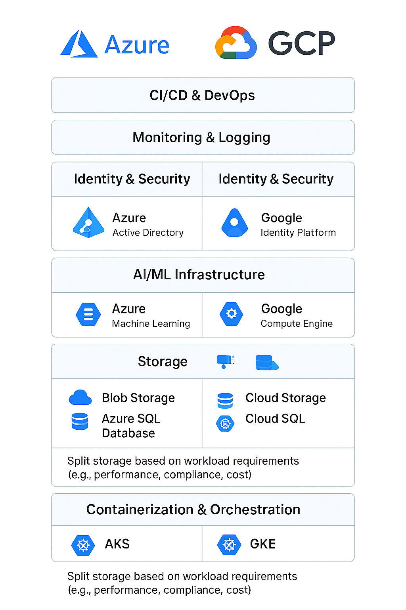

# Multi Cloud Infrastructure

As part of my program leadership in GenAI in ASPICE, it was necessary to reduce mounting costs due to the rising need of trials from employees across the globe. I facilitated seamless coordination of my team with the IT department to implement a cost-optimized, multi-cloud infrastructure leveraging Azure and GCP, enabling scalable AI workloads and virtual machine deployments.

The focus was more on cost optimization strategies (e.g., reserved instances, autoscaling, workload placement) while tailoring AI and VM environments to business requirements.&#x20;

<figure><figcaption></figcaption></figure>
