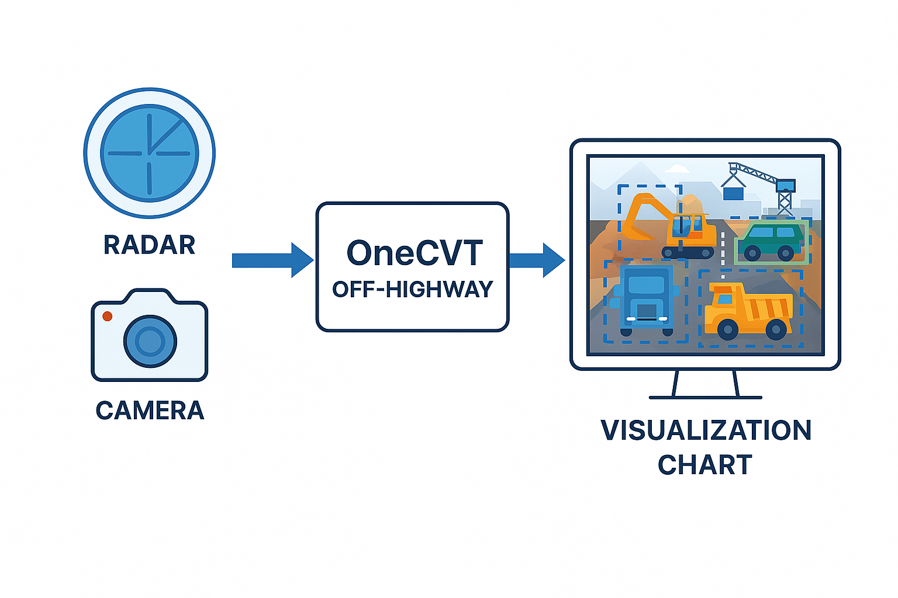

# Visualization, Masking and Calibration Tool

After joining Bosch in 2019, I quickly recognized a critical challenge facing our sales team: demonstrating the value of our refurbished automotive sensors—including RADAR and camera systems for off-highway and rail applications. These surround sensors offered two key advantages. First, they enhanced workplace safety by detecting personnel in hazardous machine zones. Second, they featured reconfigurable capabilities, allowing customers to purchase off-the-shelf units and customize parameters such as message IDs, target detection limits, and safety zone distances.

To overcome low market adoption and help customers understand the technology's benefits, I coordinated the development of Off-Highway OneCVT (One Configuration and Visualization Tool). This solution bundled sensor kits with an analysis platform, enabling customers to evaluate sensor performance on a single machine before committing to mass production integration.

I collaborated with the product team to gather requirements and drive the technical implementation. Since the sensors used CAN bus output, we selected the cost-effective PEAK CAN adapter over premium alternatives like Vector dongles. My team built the solution using the .NET framework and C# programming language, with my responsibilities encompassing resource planning, budget management, and software release scheduling.

<figure><figcaption></figcaption></figure>

C#, .NET, Python, C++
